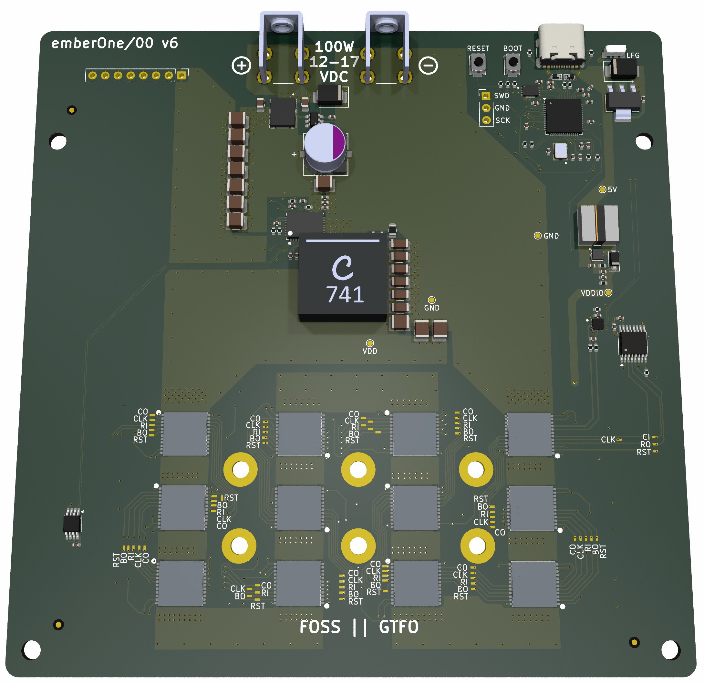

## emberOne/00

A 100W open source ASIC Bitcoin mining hashboard.

- Wide 12-17VDC input voltage.
- Separate, USB connected control board required.
	- Firmware support in [Mujina Firmware](https://github.com/256foundation/mujina/)
- Onboard RP2040 usbserial converter [firmware](https://github.com/256-Foundation/emberone-usbserial-fw)

The emberOne/00 is designed with twelve BM1362AC from the Bitmain Antminer S19j Pro (see notes below). All of the chips are powered in series. It should reach about 3.5 TH/s

## Building
The emberOne/00 _can_ be hand built. It's difficult, but you can do it with mininimal equipment and (maximal) patience. Check out these [assembly tips](assembly.md)

### ASICs
The emberOne/00 uses the Bitmain BM1362 chips from the S19j Pro. Make sure to use the BM1362AA, AB, AC or AD variants. It's possible that the BM1362AI, and BD variants could work, but they are untested. BM1362AJ and AK variants **WILL NOT** work.

## Hacking
emberOne design files are built using the incredible, FOSS PCB CAD software [KiCad](https://kicad.org). Please fork, hack and release!

## License
The emberOne is open source. Licensed under the [CERN-OHL-S-2.0](LICENSE). You are free to use, modify, understand and distribute this project. You must release the source of any changes under the same license.

©️ [256 Foundation](https://256foundation.org)
