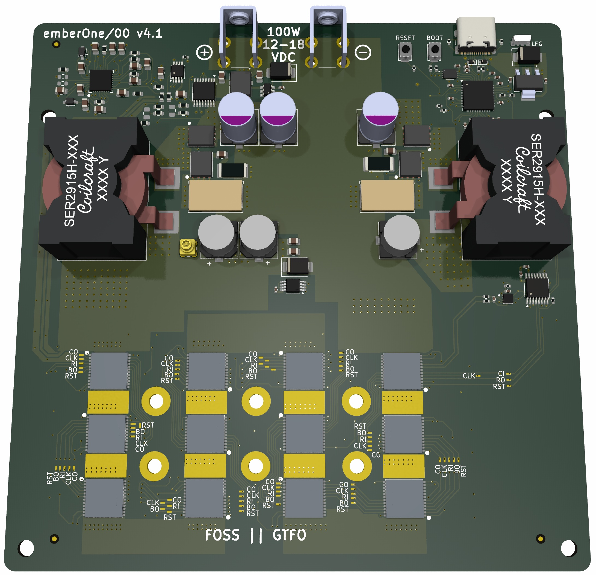

## emberOne/00

A 100W open source ASIC Bitcoin mining hashboard.

- Wide 12-18VDC input voltage.
- Separate, USB connected control board required.
	- Firmware support coming soon in [Mujina Firmware](https://mujina.org)
	- Initial testing emberOne firmware support (hacked into) [PiAxe/Pyminer fork](https://github.com/skot/emberone-miner/tree/emberone-BM1362-support)
	- Firmware for the onboard RP2040 usbserial converter: https://github.com/256-Foundation/emberone-usbserial-fw

The emberOne/00 is based on the BM1362 from the Bitmain Antminer S19j Pro (see notes below). It should reach about 3.5 TH/s

## Building
The emberOne/00 _can_ be hand built. It's difficult, but you can do it with mininimal equipment and patience. Check out these [assembly tips](assembly.md)

### ASICs
The emberOne/00 uses the Bitmain BM1362 chips from the S19j Pro. Make sure to use the BM1362AA, AB, AC or AD variants. It's possible that the BM1362AI, and BD variants could work, but they are untested. BM1362AJ and AK variants **WILL NOT** work.

## Hacking
emberOne design files are built using the incredible, FOSS PCB CAD software [KiCad](https://kicad.org). Please fork, hack and release!
